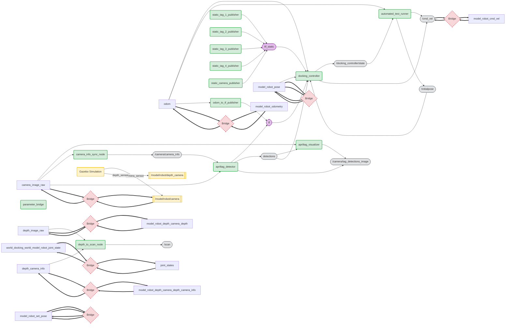

# Complete System Architecture (with Hidden Dependencies)

```mermaid
graph LR
    classDef rosNode fill:#d4edda,stroke:#28a745,stroke-width:2px;
    classDef gzNode fill:#fff3cd,stroke:#ffc107,stroke-width:2px;
    classDef topic fill:#e2e3e5,stroke:#6c757d,stroke-width:1px,rx:5,ry:5;
    classDef bridge fill:#f8d7da,stroke:#dc3545,stroke-width:2px,stroke-dasharray: 5 5;
    classDef tf fill:#e1bee7,stroke:#8e24aa,stroke-width:1px,rx:5,ry:5;

    %% Unified ROS Nodes
    apriltag_visualizer(apriltag_visualizer):::rosNode
    apriltag_visualizer --> camera_tag_detections_image([/camera/tag_detections_image]):::topic
    camera_image_raw --> apriltag_visualizer
    detections --> apriltag_visualizer
    docking_controller(docking_controller):::rosNode
    docking_controller --> docking_controller_state([/docking_controller/state]):::topic
    docking_controller --> cmd_vel([/cmd_vel]):::topic
    tf --> docking_controller
    tf_static --> docking_controller
    model_robot_pose --> docking_controller
    initialpose --> docking_controller
    odom --> docking_controller
    detections --> docking_controller
    automated_test_runner(automated_test_runner):::rosNode
    automated_test_runner --> cmd_vel([/cmd_vel]):::topic
    automated_test_runner --> initialpose([/initialpose]):::topic
    docking_controller_state --> automated_test_runner
    odom --> automated_test_runner
    odom_to_tf_publisher(odom_to_tf_publisher):::rosNode
    odom_to_tf_publisher --> tf([/tf]):::tf
    odom --> odom_to_tf_publisher
    camera_info_sync_node(camera_info_sync_node):::rosNode
    camera_info_sync_node --> camera_camera_info([/camera/camera_info]):::topic
    camera_image_raw --> camera_info_sync_node
    parameter_bridge(parameter_bridge):::rosNode
    apriltag_detector(apriltag_detector):::rosNode
    apriltag_detector --> tf([tf]):::tf
    apriltag_detector --> detections([detections]):::topic
    apriltag_detector --> camera_tag_detections_image([/camera/tag_detections_image]):::topic
    camera_image_raw --> apriltag_detector
    camera_camera_info --> apriltag_detector
    depth_to_scan_node(depth_to_scan_node):::rosNode
    depth_to_scan_node --> scan([/scan]):::topic
    depth_image_raw --> depth_to_scan_node
    depth_camera_info --> depth_to_scan_node
    static_tag_1_publisher(static_tag_1_publisher):::rosNode
    static_tag_1_publisher --> tf_static([/tf_static]):::tf
    static_tag_2_publisher(static_tag_2_publisher):::rosNode
    static_tag_2_publisher --> tf_static([/tf_static]):::tf
    static_tag_3_publisher(static_tag_3_publisher):::rosNode
    static_tag_3_publisher --> tf_static([/tf_static]):::tf
    static_tag_4_publisher(static_tag_4_publisher):::rosNode
    static_tag_4_publisher --> tf_static([/tf_static]):::tf
    static_camera_publisher(static_camera_publisher):::rosNode
    static_camera_publisher --> tf_static([/tf_static]):::tf

    %% Gazebo & Bridge
    GazeboSim(Gazebo Simulation):::gzNode
    GazeboSim -- camera_sensor --> model_robot_camera[[/model/robot/camera]]:::gzNode
    GazeboSim -- depth_sensor --> model_robot_depth_camera[[/model/robot/depth_camera]]:::gzNode
    model_robot_cmd_vel ==> Bridge_cmd_vel_model_robot_cmd_vel{Bridge}:::bridge ==> cmd_vel
    cmd_vel ==> Bridge_cmd_vel_model_robot_cmd_vel{Bridge}:::bridge ==> model_robot_cmd_vel
    model_robot_odometry ==> Bridge_odom_model_robot_odometry{Bridge}:::bridge ==> odom
    odom ==> Bridge_odom_model_robot_odometry{Bridge}:::bridge ==> model_robot_odometry
    world_docking_world_model_robot_joint_state ==> Bridge_joint_states_world_docking_world_model_robot_joint_state{Bridge}:::bridge ==> joint_states
    joint_states ==> Bridge_joint_states_world_docking_world_model_robot_joint_state{Bridge}:::bridge ==> world_docking_world_model_robot_joint_state
    model_robot_camera ==> Bridge_camera_image_raw_model_robot_camera{Bridge}:::bridge ==> camera_image_raw
    camera_image_raw ==> Bridge_camera_image_raw_model_robot_camera{Bridge}:::bridge ==> model_robot_camera
    model_robot_depth_camera_depth ==> Bridge_depth_image_raw_model_robot_depth_camera_depth{Bridge}:::bridge ==> depth_image_raw
    depth_image_raw ==> Bridge_depth_image_raw_model_robot_depth_camera_depth{Bridge}:::bridge ==> model_robot_depth_camera_depth
    model_robot_depth_camera_depth_camera_info ==> Bridge_depth_camera_info_model_robot_depth_camera_depth_camera_info{Bridge}:::bridge ==> depth_camera_info
    depth_camera_info ==> Bridge_depth_camera_info_model_robot_depth_camera_depth_camera_info{Bridge}:::bridge ==> model_robot_depth_camera_depth_camera_info
    model_robot_pose ==> Bridge_model_robot_pose_model_robot_pose{Bridge}:::bridge ==> model_robot_pose
    model_robot_pose ==> Bridge_model_robot_pose_model_robot_pose{Bridge}:::bridge ==> model_robot_pose
    model_robot_set_pose ==> Bridge_model_robot_set_pose_model_robot_set_pose{Bridge}:::bridge ==> model_robot_set_pose
    model_robot_set_pose ==> Bridge_model_robot_set_pose_model_robot_set_pose{Bridge}:::bridge ==> model_robot_set_pose
```